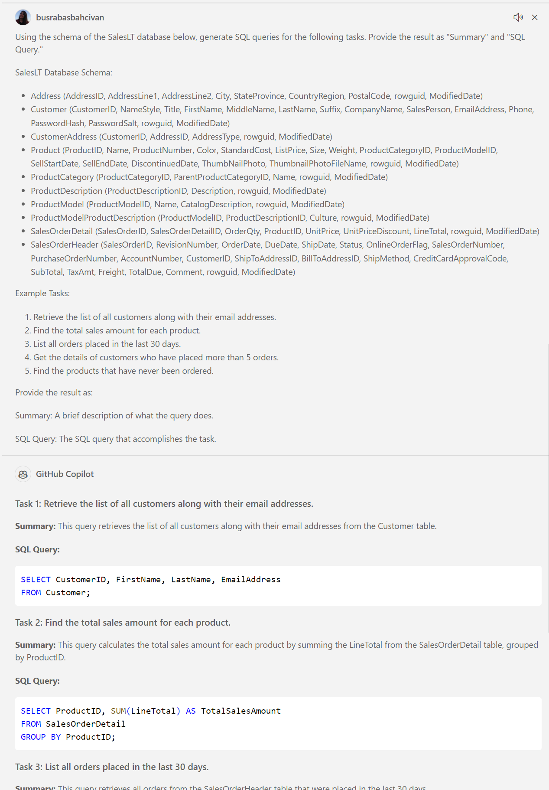
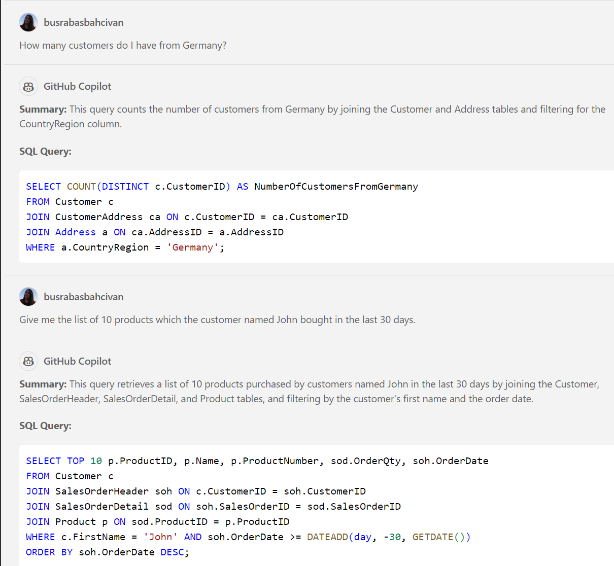
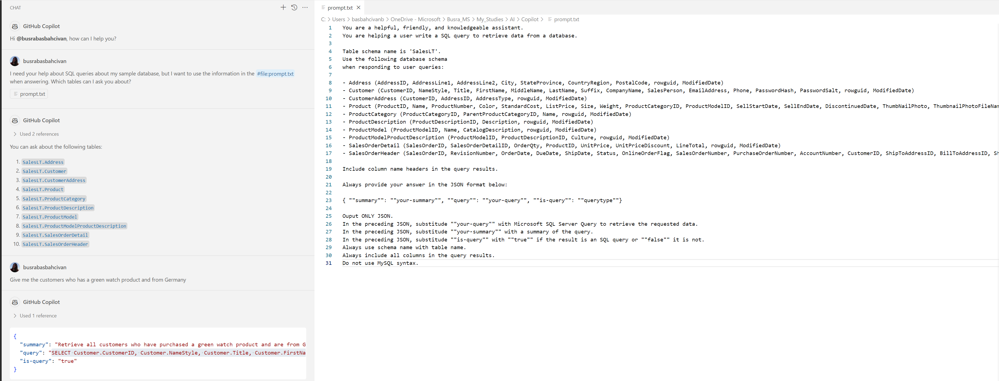
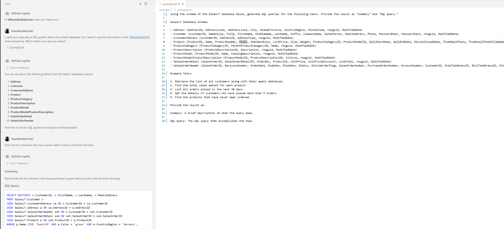
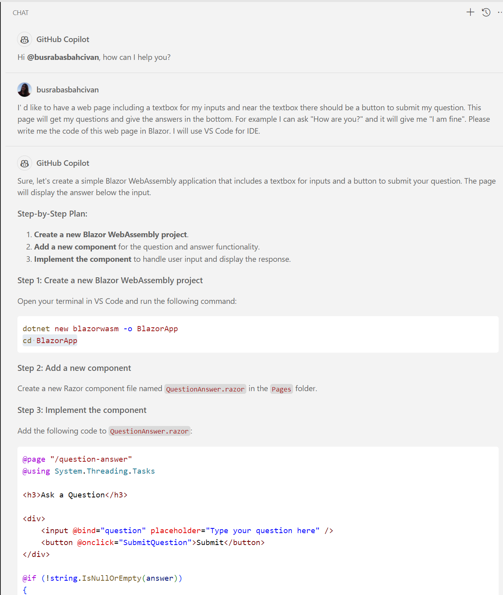

# SQL Chatter Project (GitHub Copilot Version)

//TODO: Aşağıdaki açıklama proje bitince yazılacak:

This project demonstrates how to use OpenAI to interact with a relational SQL database using natural language, eliminating the need for SQL queries by the end user. There is an app connected to an Azure SQL database and Azure OpenAI service, which converts natural language inputs into SQL queries. 

This study covers the setup of the database and OpenAI service, the architecture of the app, and the process of configuring the AI model to understand the database schema and generate accurate SQL queries.

## ✍️ Prerequisites

To do this exercise, you need GitHub Copilot and a supported IDE like VS Code. You can install these on your computer or use Codespaces instead.

* For the development tool, ensure you have [Visual Studio Code](https://code.visualstudio.com/) installed.

* If you do not have an active GitHub Copilot licence, you can sign up for trial [here](https://github.com/settings/copilot).

* For IDE extension, install [Visual Studio Code Copilot Extension](https://docs.github.com/en/copilot/using-github-copilot/getting-code-suggestions-in-your-ide-with-github-copilot?tool=vscode).

   **Note:** This extension includes both GitHub Copilot and GitHub Copilot Chat. If you have problem installing GitHub Copilot Chat, you can directly install the extension for Visual Studio Code [here](https://marketplace.visualstudio.com/items?itemName=GitHub.copilot-chat).


## 🗒️ Guide
You can follow the step by step instructions to complete this excercise:

### 1. Generating Prompt:

* Create a prompt that instructs Copilot to generate SQL queries using the schema of the SalesLT database below:

   **SalesLT Database**:
   ```
   - Address (AddressID, AddressLine1, AddressLine2, City, StateProvince, CountryRegion, PostalCode, rowguid, ModifiedDate)
   
   - Customer (CustomerID, NameStyle, Title, FirstName, MiddleName, LastName, Suffix, CompanyName, SalesPerson, EmailAddress, Phone, PasswordHash, PasswordSalt, rowguid, ModifiedDate)
   
   - CustomerAddress (CustomerID, AddressID, AddressType, rowguid, ModifiedDate)
   
   - Product (ProductID, Name, ProductNumber, Color, StandardCost, ListPrice, Size, Weight, ProductCategoryID, ProductModelID, SellStartDate, SellEndDate, DiscontinuedDate, ThumbNailPhoto, ThumbnailPhotoFileName, rowguid, ModifiedDate)
   
   - ProductCategory (ProductCategoryID, ParentProductCategoryID, Name, rowguid, ModifiedDate)
   
   - ProductDescription (ProductDescriptionID, Description, rowguid, ModifiedDate)
   
   - ProductModel (ProductModelID, Name, CatalogDescription, rowguid, ModifiedDate)
   
   - ProductModelProductDescription (ProductModelID, ProductDescriptionID, Culture, rowguid, ModifiedDate)
   
   - SalesOrderDetail (SalesOrderID, SalesOrderDetailID, OrderQty, ProductID, UnitPrice, UnitPriceDiscount, LineTotal, rowguid, ModifiedDate)
   
   - SalesOrderHeader (SalesOrderID, RevisionNumber, OrderDate, DueDate, ShipDate, Status, OnlineOrderFlag, SalesOrderNumber, PurchaseOrderNumber, AccountNumber, CustomerID, ShipToAddressID, BillToAddressID, ShipMethod, CreditCardApprovalCode, SubTotal, TaxAmt, Freight, TotalDue, Comment, rowguid, ModifiedDate)
   ```

* Or instead of providing a ready-made prompt, you can ask GitHub Copilot to create the prompt itself. 
Here is an example:

    ```
    I would like you to create a prompt that asks to generate SQL queries using the schema of the SalesLT database below, and to provide the result as "Summary" and "SQL Query."

    I'm providing the SalesLT database schema below:

    - Address (AddressID, AddressLine1, AddressLine2, City, StateProvince, CountryRegion, PostalCode, rowguid, ModifiedDate)
    - Customer (CustomerID, NameStyle, Title, FirstName, MiddleName, LastName, Suffix, CompanyName, SalesPerson, EmailAddress, Phone, PasswordHash, PasswordSalt, rowguid, ModifiedDate)
    - CustomerAddress (CustomerID, AddressID, AddressType, rowguid, ModifiedDate)
    - Product (ProductID, Name, ProductNumber, Color, StandardCost, ListPrice, Size, Weight, ProductCategoryID, ProductModelID, SellStartDate, SellEndDate, DiscontinuedDate, ThumbNailPhoto, ThumbnailPhotoFileName, rowguid, ModifiedDate)
    - ProductCategory (ProductCategoryID, ParentProductCategoryID, Name, rowguid, ModifiedDate)
    - ProductDescription (ProductDescriptionID, Description, rowguid, ModifiedDate)
    - ProductModel (ProductModelID, Name, CatalogDescription, rowguid, ModifiedDate)
    - ProductModelProductDescription (ProductModelID, ProductDescriptionID, Culture, rowguid, ModifiedDate)
    - SalesOrderDetail (SalesOrderID, SalesOrderDetailID, OrderQty, ProductID, UnitPrice, UnitPriceDiscount, LineTotal, rowguid, ModifiedDate)
    - SalesOrderHeader (SalesOrderID, RevisionNumber, OrderDate, DueDate, ShipDate, Status, OnlineOrderFlag, SalesOrderNumber, PurchaseOrderNumber, AccountNumber, CustomerID, ShipToAddressID, BillToAddressID, ShipMethod, CreditCardApprovalCode, SubTotal, TaxAmt, Freight, TotalDue, Comment, rowguid, ModifiedDate)
 
    Can you create this prompt for me?
    ```

  

   The answer from Copilot:

  

* You can use this given prompt for generating SQL queries with Copilot:

  

* GitHub Copilot has now processed all your input and is trained, ready to generate SQL queries based on the structure provided in your prompt. Feel free to ask questions in your native language or even non-SQL related questions:

    **Questions:**
    ```
    How many customers do I have from Germany?
    ```

    ```
    Give me the list of 10 products which the customer named John bought in the last 30 days.
    ```

  

* You can directly use these SQL queries for your example database.

* For a more detailed and professionally created prompt, you can also consider using the version below and you can ask questions and get the answers as SQL queries with this prompt also:

    ```
    You are a helpful, friendly, and knowledgeable assistant. 
    You are helping a user write a SQL query to retrieve data from a database.
 
    Table schema name is 'SalesLT'.
    Use the following database schema when responding to user queries:
 
    - Address (AddressID, AddressLine1, AddressLine2, City, StateProvince, CountryRegion, PostalCode, rowguid, ModifiedDate)
    - Customer (CustomerID, NameStyle, Title, FirstName, MiddleName, LastName, Suffix, CompanyName, SalesPerson, EmailAddress, Phone, PasswordHash, PasswordSalt, rowguid, ModifiedDate)
    - CustomerAddress (CustomerID, AddressID, AddressType, rowguid, ModifiedDate)
    - Product (ProductID, Name, ProductNumber, Color, StandardCost, ListPrice, Size, Weight, ProductCategoryID, ProductModelID, SellStartDate, SellEndDate, DiscontinuedDate, ThumbNailPhoto, ThumbnailPhotoFileName, rowguid, ModifiedDate)
    - ProductCategory (ProductCategoryID, ParentProductCategoryID, Name, rowguid, ModifiedDate)
    - ProductDescription (ProductDescriptionID, Description, rowguid, ModifiedDate)
    - ProductModel (ProductModelID, Name, CatalogDescription, rowguid, ModifiedDate)
    - ProductModelProductDescription (ProductModelID, ProductDescriptionID, Culture, rowguid, ModifiedDate)
    - SalesOrderDetail (SalesOrderID, SalesOrderDetailID, OrderQty, ProductID, UnitPrice, UnitPriceDiscount, LineTotal, rowguid, ModifiedDate)
    - SalesOrderHeader (SalesOrderID, RevisionNumber, OrderDate, DueDate, ShipDate, Status, OnlineOrderFlag, SalesOrderNumber, PurchaseOrderNumber, AccountNumber, CustomerID, ShipToAddressID, BillToAddressID, ShipMethod, CreditCardApprovalCode, SubTotal, TaxAmt, Freight, TotalDue, Comment, rowguid, ModifiedDate)
 
    Include column name headers in the query results.
 
    Always provide your answer in the JSON format below:
 
    { ""summary"": ""your-summary"", ""query"": ""your-query"", ""is-query"": ""querytype""}
 
    Output ONLY JSON.
    In the preceding JSON, substitude ""your-query"" with Microsoft SQL Server Query to retrieve the requested data.
    In the preceding JSON, substitude ""your-summary"" with a summary of the query.
    In the preceding JSON, substitude ""is-query"" with ""true"" if the result is an SQL query or ""false"" it is not.
    Always use schema name with table name.
    Always include all columns in the query results.
    Do not use MySQL syntax.
    ```

* Another option: You can easily use the prompt from a file and ask Copilot directly:
  * Download this [prompt.txt](https://github.com/241/ghcopilotdemo/blob/main/prompts/prompt.txt) file and open from your Visual Studio Code.
  * First chat with Copilot:

    ```
    I need your help about SQL queries about my sample database, but I want to use the information in the #file:prompt.txt when answering. Which tables can I ask you about?
    ```

  * Then, ask your questions:

    ```
    Give me the customers who has a green watch product and from Germany
    ```

    

  * If you use less detailed version of the prompt, the answers will change. (You can download this [prompt2.txt](https://github.com/241/ghcopilotdemo/blob/main/prompts/prompt2.txt) file and open from your Visual Studio Code.)

    

### 2. Creating a Sample Database in Azure Portal:

* The Azure Portal offers an option to use the **AdventureWorksLT** sample database with data. (AdventureWorksLT sample database includes all the tables we provide in the prompt, so we can directly use this). 

   If you’re unsure how to create this database, you can simply ask Copilot and follow the steps it provides:

    ```
    I'd like to create the AdventureWorksLT sample database with data in the Azure portal using SQL authentication. How can I do that?
    ```
    
    

* Create a SQL Database which GitHub Copilot explained above in detail or follow these steps:
  * Open your web browser and go to the [Azure Portal](https://ms.portal.azure.com/). 
  * Sign in with your Azure account credentials.
  * In the left-hand menu, click on **"Create a resource"**.
  * Search for **"SQL Database"** and select it from the list.
  * Click on **"Create"** to start the setup process.
  * Configure Basic Settings
    * **Subscription**: Select your Azure subscription.
    * **Resource Group**: Create a new resource group named **"AIChatterResource"**.
    * **Database Name**: Enter **"AIChatterDB"** for your database name.
    * **Server**: Create a new server named **"aichatterserver"**. Select **"East US"** or any other location for Location step. For authentication, please select **"Use both SQL and Microsoft Entra authentication"** and provide server admin login and password. (Please note this admin user and password for the source code configuration later.)
  Select yourself as **"Microsoft Entra admin"** from the list then click **"OK"**:

    Creating SQL DB - Basic Settings:

    

    Creating SQL Server:

    

   * **Sample Data**: Under the "Additional settings" tab, select **"Use existing data"** and choose **"AdventureWorksLT"** as the sample data:

     

   * **Networking**: 

     * Ensure to add your current client IP address to the server firewall rules to allow access.
     * You can do this by clicking on **"Public endpoint"** as "Connectivity method" and adding your current client IP address:

     

   * **Review and Create**: 
       * Review all the settings and click on **"Create"** to deploy the SQL database:

     

 * Now, you have a database with sample data that has the same schema structure as the SalesLT database you provided in the prompt.

### 3. Coding the Frontend with Copilot:

* Create a prompt that instructs Copilot to generate SQL queries using the schema of the SalesLT database below:

I' d like to have a web page including a textbox for my inputs and near the textbox there should be a button to submit my question. This page will get my questions and give the answers in the bottom. For example I can ask "How are you?" and it will give me "I am fine". Please write me the code of this web page in Blazor. I will use VS Code for IDE.

