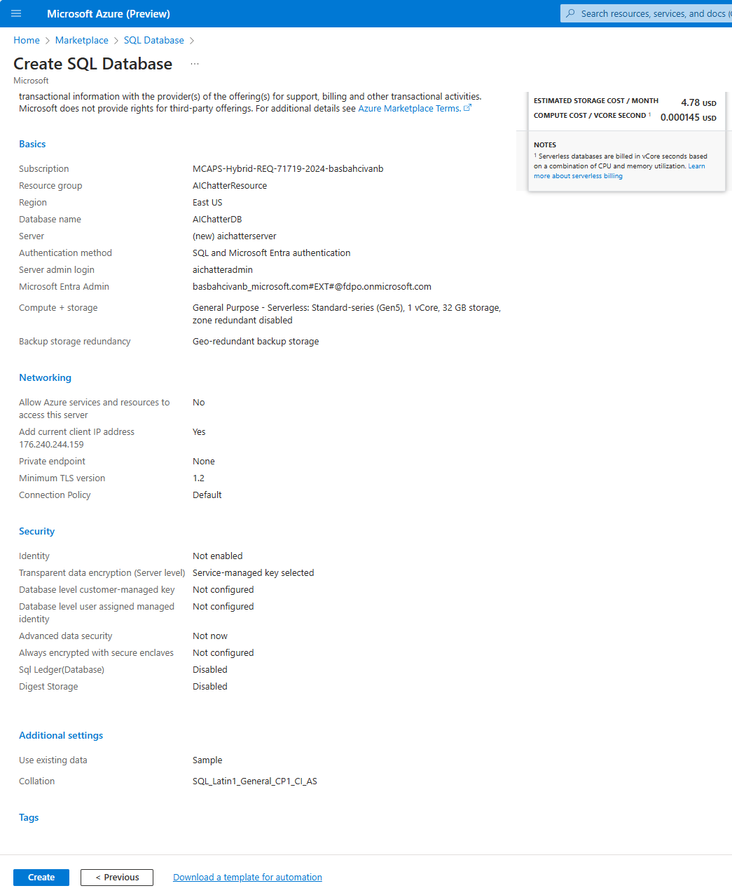

# SQL Chatter Project (GitHub Copilot Version)

This project demonstrates how to use GitHub Copilot to efficiently develop a .NET Core Web API backend and a Blazor Web App frontend for querying an Azure SQL Database. Copilot helps generate SQL queries and code, streamlining the development process.

We set up a microservices-based backend to handle SQL queries from the frontend, which allows users to input queries through the Blazor Web App. The Web API processes the queries and returns results in real-time.

Using GitHub Copilot simplifies coding tasks, automates query generation, and enhances overall productivity, making complex projects easier to manage and execute.

## ✍️ Prerequisites

To do this exercise, you need GitHub Copilot and a supported IDE like VS Code. You can install these on your computer or use Codespaces instead.

* For the development tool, ensure you have [Visual Studio Code](https://code.visualstudio.com/) installed.

* If you do not have an active GitHub Copilot licence, you can sign up for trial [here](https://github.com/settings/copilot).

* For IDE extension, install [Visual Studio Code Copilot Extension](https://docs.github.com/en/copilot/using-github-copilot/getting-code-suggestions-in-your-ide-with-github-copilot?tool=vscode).

   _**Note:** This extension includes both GitHub Copilot and GitHub Copilot Chat. If you have problem installing GitHub Copilot Chat, you can directly install the extension for Visual Studio Code [here](https://marketplace.visualstudio.com/items?itemName=GitHub.copilot-chat)._


## 🗒️ Guide
You can follow the step by step instructions to complete this excercise:

### 1. Generating Prompt:

* Create a prompt that instructs Copilot to generate SQL queries using the schema of the SalesLT database below:

   **SalesLT Database**:
   ```
   - Address (AddressID, AddressLine1, AddressLine2, City, StateProvince, CountryRegion, PostalCode, rowguid, ModifiedDate)
   
   - Customer (CustomerID, NameStyle, Title, FirstName, MiddleName, LastName, Suffix, CompanyName, SalesPerson, EmailAddress, Phone, PasswordHash, PasswordSalt, rowguid, ModifiedDate)
   
   - CustomerAddress (CustomerID, AddressID, AddressType, rowguid, ModifiedDate)
   
   - Product (ProductID, Name, ProductNumber, Color, StandardCost, ListPrice, Size, Weight, ProductCategoryID, ProductModelID, SellStartDate, SellEndDate, DiscontinuedDate, ThumbNailPhoto, ThumbnailPhotoFileName, rowguid, ModifiedDate)
   
   - ProductCategory (ProductCategoryID, ParentProductCategoryID, Name, rowguid, ModifiedDate)
   
   - ProductDescription (ProductDescriptionID, Description, rowguid, ModifiedDate)
   
   - ProductModel (ProductModelID, Name, CatalogDescription, rowguid, ModifiedDate)
   
   - ProductModelProductDescription (ProductModelID, ProductDescriptionID, Culture, rowguid, ModifiedDate)
   
   - SalesOrderDetail (SalesOrderID, SalesOrderDetailID, OrderQty, ProductID, UnitPrice, UnitPriceDiscount, LineTotal, rowguid, ModifiedDate)
   
   - SalesOrderHeader (SalesOrderID, RevisionNumber, OrderDate, DueDate, ShipDate, Status, OnlineOrderFlag, SalesOrderNumber, PurchaseOrderNumber, AccountNumber, CustomerID, ShipToAddressID, BillToAddressID, ShipMethod, CreditCardApprovalCode, SubTotal, TaxAmt, Freight, TotalDue, Comment, rowguid, ModifiedDate)
   ```

* Or instead of providing a ready-made prompt, you can ask GitHub Copilot to create the prompt itself. 
Here is an example:

    ```
    I would like you to create a prompt that asks to generate SQL queries using the schema of the SalesLT database below, and to provide the result as "Summary" and "SQL Query."

    I'm providing the SalesLT database schema below:

    - Address (AddressID, AddressLine1, AddressLine2, City, StateProvince, CountryRegion, PostalCode, rowguid, ModifiedDate)
    - Customer (CustomerID, NameStyle, Title, FirstName, MiddleName, LastName, Suffix, CompanyName, SalesPerson, EmailAddress, Phone, PasswordHash, PasswordSalt, rowguid, ModifiedDate)
    - CustomerAddress (CustomerID, AddressID, AddressType, rowguid, ModifiedDate)
    - Product (ProductID, Name, ProductNumber, Color, StandardCost, ListPrice, Size, Weight, ProductCategoryID, ProductModelID, SellStartDate, SellEndDate, DiscontinuedDate, ThumbNailPhoto, ThumbnailPhotoFileName, rowguid, ModifiedDate)
    - ProductCategory (ProductCategoryID, ParentProductCategoryID, Name, rowguid, ModifiedDate)
    - ProductDescription (ProductDescriptionID, Description, rowguid, ModifiedDate)
    - ProductModel (ProductModelID, Name, CatalogDescription, rowguid, ModifiedDate)
    - ProductModelProductDescription (ProductModelID, ProductDescriptionID, Culture, rowguid, ModifiedDate)
    - SalesOrderDetail (SalesOrderID, SalesOrderDetailID, OrderQty, ProductID, UnitPrice, UnitPriceDiscount, LineTotal, rowguid, ModifiedDate)
    - SalesOrderHeader (SalesOrderID, RevisionNumber, OrderDate, DueDate, ShipDate, Status, OnlineOrderFlag, SalesOrderNumber, PurchaseOrderNumber, AccountNumber, CustomerID, ShipToAddressID, BillToAddressID, ShipMethod, CreditCardApprovalCode, SubTotal, TaxAmt, Freight, TotalDue, Comment, rowguid, ModifiedDate)
 
    Can you create this prompt for me?
    ```

  

   The answer from Copilot:

  

* You can use this given prompt for generating SQL queries with Copilot:

  

* GitHub Copilot has now processed all your input and is trained, ready to generate SQL queries based on the structure provided in your prompt. Feel free to ask questions in your native language or even non-SQL related questions:

    **Questions:**
    ```
    How many customers do I have from Germany?
    ```

    ```
    Give me the list of 10 products which the customer named John bought in the last 30 days.
    ```

  

* You can directly use these SQL queries for your example database.

* For a more detailed and professionally created prompt, you can also consider using the version below and you can ask questions and get the answers as SQL queries with this prompt also **(In this exercise, we used this prompt)**:

    ```
    You are a helpful, friendly, and knowledgeable assistant. 
    You are helping a user write a SQL query to retrieve data from a database.
 
    Table schema name is 'SalesLT'.
    Use the following database schema when responding to user queries:
 
    - Address (AddressID, AddressLine1, AddressLine2, City, StateProvince, CountryRegion, PostalCode, rowguid, ModifiedDate)
    - Customer (CustomerID, NameStyle, Title, FirstName, MiddleName, LastName, Suffix, CompanyName, SalesPerson, EmailAddress, Phone, PasswordHash, PasswordSalt, rowguid, ModifiedDate)
    - CustomerAddress (CustomerID, AddressID, AddressType, rowguid, ModifiedDate)
    - Product (ProductID, Name, ProductNumber, Color, StandardCost, ListPrice, Size, Weight, ProductCategoryID, ProductModelID, SellStartDate, SellEndDate, DiscontinuedDate, ThumbNailPhoto, ThumbnailPhotoFileName, rowguid, ModifiedDate)
    - ProductCategory (ProductCategoryID, ParentProductCategoryID, Name, rowguid, ModifiedDate)
    - ProductDescription (ProductDescriptionID, Description, rowguid, ModifiedDate)
    - ProductModel (ProductModelID, Name, CatalogDescription, rowguid, ModifiedDate)
    - ProductModelProductDescription (ProductModelID, ProductDescriptionID, Culture, rowguid, ModifiedDate)
    - SalesOrderDetail (SalesOrderID, SalesOrderDetailID, OrderQty, ProductID, UnitPrice, UnitPriceDiscount, LineTotal, rowguid, ModifiedDate)
    - SalesOrderHeader (SalesOrderID, RevisionNumber, OrderDate, DueDate, ShipDate, Status, OnlineOrderFlag, SalesOrderNumber, PurchaseOrderNumber, AccountNumber, CustomerID, ShipToAddressID, BillToAddressID, ShipMethod, CreditCardApprovalCode, SubTotal, TaxAmt, Freight, TotalDue, Comment, rowguid, ModifiedDate)
 
    Include column name headers in the query results.
 
    Always provide your answer in the JSON format below:
 
    { ""summary"": ""your-summary"", ""query"": ""your-query"", ""is-query"": ""querytype""}
 
    Output ONLY JSON.
    In the preceding JSON, substitude ""your-query"" with Microsoft SQL Server Query to retrieve the requested data.
    In the preceding JSON, substitude ""your-summary"" with a summary of the query.
    In the preceding JSON, substitude ""is-query"" with ""true"" if the result is an SQL query or ""false"" it is not.
    Always use schema name with table name.
    Always include all columns in the query results.
    Do not use MySQL syntax.
    ```

* Another option: You can easily use the prompt from a file and ask Copilot directly:
  * Download this [prompt.txt](https://github.com/241/ghcopilotdemo/blob/main/prompts/prompt.txt) file and open from your Visual Studio Code.
  * First chat with Copilot:

    ```
    I need your help about SQL queries about my sample database, but I want to use the information in the #file:prompt.txt when answering. Which tables can I ask you about?
    ```

  * Then, ask your questions:

    ```
    Give me the customers who has a green watch product and from Germany
    ```

    

  * If you use less detailed version of the prompt, the answers will change. (You can download this [prompt2.txt](https://github.com/241/ghcopilotdemo/blob/main/prompts/prompt2.txt) file and open from your Visual Studio Code.)

    

### 2. Creating a Sample Database in Azure Portal:

* The Azure Portal offers an option to use the **AdventureWorksLT** sample database with data. (AdventureWorksLT sample database includes all the tables we provide in the prompt, so we can directly use this). 

   If you’re unsure how to create this database, you can simply ask Copilot and follow the steps it provides:

    ```
    I'd like to create the AdventureWorksLT sample database with data in the Azure portal using SQL authentication. How can I do that?
    ```
    
    

* Create a SQL Database which GitHub Copilot explained above in detail or follow these steps:
  * Open your web browser and go to the [Azure Portal](https://ms.portal.azure.com/). 
  * Sign in with your Azure account credentials.
  * In the left-hand menu, click on **"Create a resource"**.
  * Search for **"SQL Database"** and select it from the list.
  * Click on **"Create"** to start the setup process.
  * Configure Basic Settings
    * **Subscription**: Select your Azure subscription.
    * **Resource Group**: Create a new resource group named **"AIChatterResource"**.
    * **Database Name**: Enter **"AIChatterDB"** for your database name.
    * **Server**: Create a new server named **"aichatterserver"**. Select **"East US"** or any other location for Location step. For authentication, please select **"Use both SQL and Microsoft Entra authentication"** and provide server admin login and password. (Please note this admin user and password for the source code configuration later.)
  Select yourself as **"Microsoft Entra admin"** from the list then click **"OK"**:

    Creating SQL DB - Basic Settings:

    

    Creating SQL Server:

    

   * **Sample Data**: Under the "Additional settings" tab, select **"Use existing data"** and choose **"AdventureWorksLT"** as the sample data:

     

   * **Networking**: 

     * Ensure to add your current client IP address to the server firewall rules to allow access.
     * You can do this by clicking on **"Public endpoint"** as "Connectivity method" and adding your current client IP address:

     

   * **Review and Create**: 
       * Review all the settings and click on **"Create"** to deploy the SQL database:

     

 * Now, you have a database with sample data that has the same schema structure as the SalesLT database you provided in the prompt.

### 3. Coding the SQLChatter Project with Copilot:

We have a sample Azure SQL Database created in Step 2. We want to send queries to this DB using SQL statements and retrieve the responses. To do this, let’s code two separate projects: Backend and Frontend.

First, we need a query statement prepared to send to the DB. For this, we will train GitHub Copilot using a prompt as described in Step 1. In this example, we used [prompt.txt](https://github.com/241/ghcopilotdemo/blob/main/prompts/prompt.txt). 

We will ask the trained Copilot questions about tables in our native language and expect it to generate SQL statements in response. We will take this SQL statement and ask it through the Blazor Web App.

The Blazor Web App project will be our frontend project and will send the SQL query entered by the user to the Web API backend project. In this frontend project, we will ask the user to write the SQL statement into a textbox and use a button to send this query to the Web API. The result of the query will be displayed in a table format in the lower section.

The backend project will be a .NET Core Web API project, and we will design it as a microservices-based project. This API will send the SQL query received from the Blazor Web App directly to the Azure SQL Database and retrieve the response. The backend project should be able to run the query and get the response for all our tables without using any specific table models.

To summarize, the project diagram will be like this:


#### 3.1. Coding .NET Core Web API Project (Backend):

* Prepare a prompt by using the requirements in the before section (Step 3), and ask to GitHub Copilot. For example:

    ```
    Create a .NET Core Web API project. This project should be in a microservices architecture.

    In this Web API, I want to be able to send a query to an existing Azure SQL Database and receive the response. In the project you create, do not use a specific table model, as the columns in my tables can have any data type, including null. Please code accordingly.
    ```

* GitHub Copilot will prepare a project with the source code. Try to follow all the steps and try to create and code the .NET Core Web API project.

   _**Note:** Please remember that GitHub Copilot may provide different answers to each question you ask, so don't expect the same response every time. And please note that you can use GitHub Copilot for every problem you encounter while coding. You can even send runtime errors directly to GitHub Copilot and get a solution._

   

* If you want to use a pre-built .NET Core Web API backend project, you can download it from here. //TODO: link verilecek
  * In the **"appsettings.json"** file and find the "AzureSqlDatabase" object:

      
  
  * Update above code in **"appsettings.json"** file with the following detailed information from Azure Portal:

     * In the Azure Portal, go to the SQL Databases and find your created database named **"AIChatterDB "**.
     * Under the "Connection strings" menu in the left, copy "ADO.NET (SQL authentication)" connection string and replace the "AzureSqlDatabase" value in **"appsettings.json"** file.

  * You should install the required Nuget packages into your solution:

     ```dotnet restore```

  * You can run your Web API project and validate the service by testing its endpoints directly within the Swagger UI, which will automatically generate the API documentation and allow for real-time interaction with your API. For this, use these 2 commands:
     
     ```dotnet build```

     ```dotnet run```

      

  * If you prefer to call your Web API using Postman, your endpoint url will be ```https://localhost:7029/SQLChatter/execute-query``` and you should use "POST" method: 

      The header parameters are:

       

      The body and the result:

       

  * Now, your Web API is ready to run the SQL Queries which comes from frontend.

#### 3.2. Coding Blazor Web App Project (Frontend):

* Prepare a prompt by using the requirements in the before section (Step 3), and ask to GitHub Copilot. For example:

    ```
   Create a Blazor Web App project as the frontend that will send SQL queries entered by the user to a Web API backend project with the URL "https://localhost:7029/SQLChatter/execute-query". 
   
   In this frontend, include a textbox where the user can input a SQL statement and a button to send the query to the Web API. The response from the API should be displayed in a table format in the lower section of the page.
    ```

* GitHub Copilot will prepare a project with the source code. Try to follow all the steps and try to create and code the Blazor Web App project.

   _**Note:** Please remember that GitHub Copilot may provide different answers to each question you ask, so don't expect the same response every time. And please note that you can use GitHub Copilot for every problem you encounter while coding. You can even send runtime errors directly to GitHub Copilot and get a solution._
   
   

* If you want to use a pre-built Blazor Web App frontend project, you can download it from here. //TODO: link verilecek

   * Change the Web API address "https://localhost:7029/SQLChatter/execute-query" with yours in **Index.razor** file.

   * You should install the required Nuget packages into your solution:

     ```dotnet restore```


   * You can build & run your Web App project:
     
     ```dotnet build```

     ```dotnet run```

   * Now, your Web App is ready to send the SQL Queries to the Web API:

      

   * You can generate SQL queries using Copilot, then copy and paste them directly into the Blazor Web App. Once the query is submitted, execute it to retrieve and display the results returned from the Web API.

## 💡 Hint
While coding or running applications, you can send any issue or error you encounter to Copilot and ask for a solution. You can even have GitHub Copilot complete your entire project for you.

## 🤝 Conclusion
This exercise highlights the benefits of using GitHub Copilot for streamlining and simplifying the development process. By automating tasks like generating SQL queries and handling repetitive coding, Copilot allows you to focus on problem-solving and project goals.

Through this approach, you gain efficiency, reduce errors, and accelerate the overall workflow. The exercise also demonstrates how Copilot can support you in learning and executing complex projects, even if you’re not an expert in coding, making development more accessible and manageable.