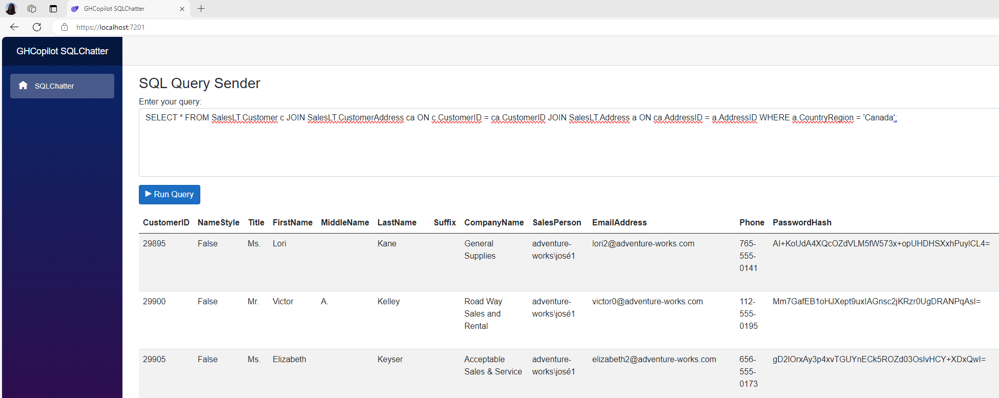

## 3.2. Coding Blazor Web App Project (Frontend):

* Prepare a prompt by using the requirements in the before section (Step 3), and ask to GitHub Copilot. For example:

    ```
   Create a Blazor Web App project as the frontend that will send SQL queries entered by the user to a Web API backend project with the URL "https://localhost:7029/SQLChatter/execute-query". 
   
   In this frontend, include a textbox where the user can input a SQL statement and a button to send the query to the Web API. The response from the API should be displayed in a table format in the lower section of the page.
    ```

* GitHub Copilot will prepare a project with the source code. Try to follow all the steps and try to create and code the Blazor Web App project.

   _**Note:** Please remember that GitHub Copilot may provide different answers to each question you ask, so don't expect the same response every time. And please note that you can use GitHub Copilot for every problem you encounter while coding. You can even send runtime errors directly to GitHub Copilot and get a solution._
   
   

* If you want to use a pre-built Blazor Web App frontend project, you can download it from [here](https://github.com/241/ghcopilotdemo/tree/main/OpenAISQLChatter_WebApp).

   * Change the Web API address "https://localhost:7029/SQLChatter/execute-query" with yours in **Index.razor** file.

   * You should install the required Nuget packages into your solution:

     ```dotnet restore```


   * You should build & run your Web App project with these 2 commands:
     
     ```dotnet build```

     ```dotnet run```

   * Now, your Web App is ready to send the SQL Queries to the Web API:

      

   * You can generate SQL queries using Copilot, then copy and paste them directly into the Blazor Web App. Once the query is submitted, execute it to retrieve and display the results returned from the Web API.

   &nbsp;
> Please continue to: [Conclusion](https://241.github.io/ghcopilotdemo/SQLChatter_GitHubCopilot/0104_Conclusion.html).