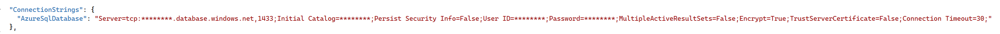

#### 3.2. Coding Blazor Web App Project (Frontend):

* Prepare a prompt by using the requirements in the before section (Step 3), and ask to GitHub Copilot. For example:

    ```
   Create a Blazor Web App project as the frontend that will send SQL queries entered by the user to a Web API backend project with the URL "https://localhost:7029/SQLChatter/execute-query". 
   
   In this frontend, include a textbox where the user can input a SQL statement and a button to send the query to the Web API. The response from the API should be displayed in a table format in the lower section of the page.
    ```

* GitHub Copilot will prepare a project with the source code. Try to follow all the steps and try to create and code the Blazor Web App project.

   _**Note:** Please remember that GitHub Copilot may provide different answers to each question you ask, so don't expect the same response every time. And please note that you can use GitHub Copilot for every problem you encounter while coding. You can even send runtime errors directly to GitHub Copilot and get a solution._
   
   

* If you want to use a pre-built Blazor Web App frontend project, you can download it from here. //TODO: link verilecek

   * Change the Web API address "https://localhost:7029/SQLChatter/execute-query" with yours in **Index.razor** file.

   * You should install the required Nuget packages into your solution:

     ```dotnet restore```


   * You can build & run your Web App project:
     
     ```dotnet build```

     ```dotnet run```

   * Now, your Web App is ready to send the SQL Queries to the Web API:

      

   * You can generate SQL queries using Copilot, then copy and paste them directly into the Blazor Web App. Once the query is submitted, execute it to retrieve and display the results returned from the Web API.


* Prepare a prompt by using the requirements in the before section (Step 3), and ask to GitHub Copilot. For example:

    ```
    Create a .NET Core Web API project. This project should be in a microservices architecture.

    In this Web API, I want to be able to send a query to an existing Azure SQL Database and receive the response. In the project you create, do not use a specific table model, as the columns in my tables can have any data type, including null. Please code accordingly.
    ```

* GitHub Copilot will prepare a project with the source code. Try to follow all the steps and try to create and code the .NET Core Web API project.

   _**Note:** Please remember that GitHub Copilot may provide different answers to each question you ask, so don't expect the same response every time. And please note that you can use GitHub Copilot for every problem you encounter while coding. You can even send runtime errors directly to GitHub Copilot and get a solution._

   

* If you want to use a pre-built .NET Core Web API backend project, you can download it from here. //TODO: link verilecek
  * In the **"appsettings.json"** file and find the "AzureSqlDatabase" object:

      
  
  * Update above code in **"appsettings.json"** file with the following detailed information from Azure Portal:

     * In the Azure Portal, go to the SQL Databases and find your created database named **"AIChatterDB "**.
     * Under the "Connection strings" menu in the left, copy "ADO.NET (SQL authentication)" connection string and replace the "AzureSqlDatabase" value in **"appsettings.json"** file.

  * You should install the required Nuget packages into your solution:

     ```dotnet restore```

  * You can run your Web API project and validate the service by testing its endpoints directly within the Swagger UI, which will automatically generate the API documentation and allow for real-time interaction with your API. For this, use these 2 commands:
     
     ```dotnet build```

     ```dotnet run```

      

  * If you prefer to call your Web API using Postman, your endpoint url will be ```https://localhost:7029/SQLChatter/execute-query``` and you should use "POST" method: 

      The header parameters are:

       

      The body and the result:

       

  * Now, your Web API is ready to run the SQL Queries which comes from frontend.