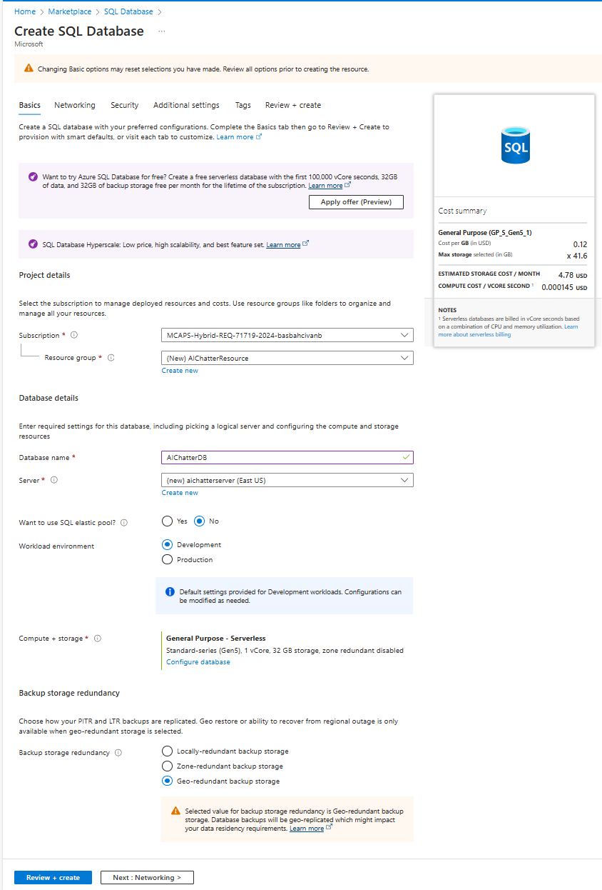
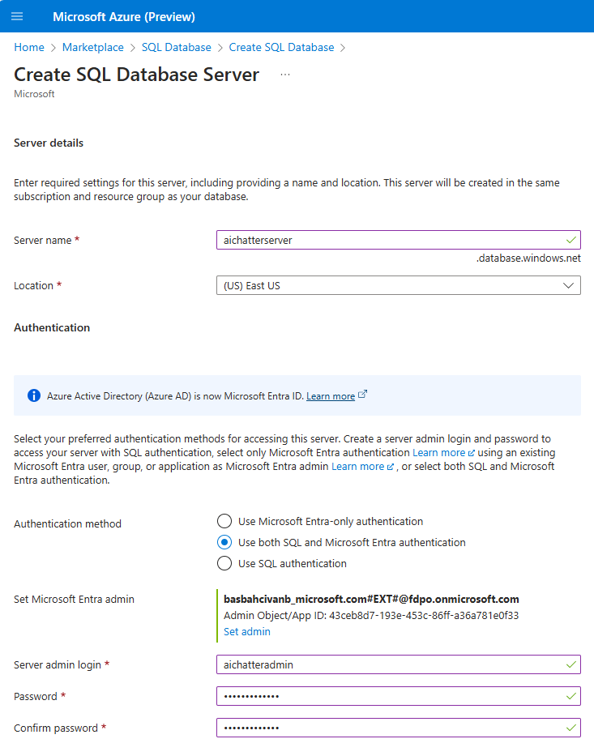
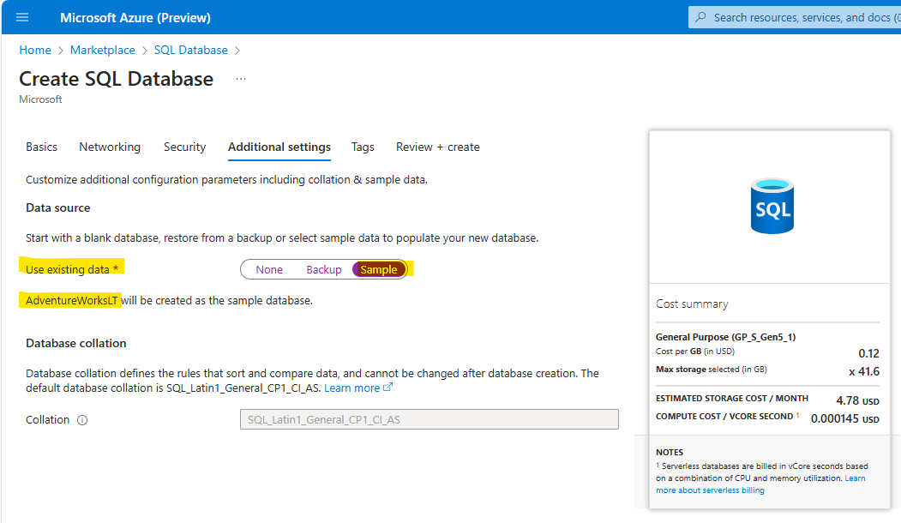

# SQL Chatter Project (Azure OpenAI Version)

This project demonstrates how to use OpenAI to interact with a relational SQL database using natural language, eliminating the need for SQL queries by the end user. There is an app connected to an Azure SQL database and Azure OpenAI service, which converts natural language inputs into SQL queries. 

This study covers the setup of the database and OpenAI service, the architecture of the app, and the process of configuring the AI model to understand the database schema and generate accurate SQL queries.

## ✍️ Prerequisites

❗Before beginning this exercise, it is essential to have an active Azure subscription with Azure OpenAI. To gain access to the Azure OpenAI service, you can request access through the following link: [Request Access to Azure OpenAI Service](https://customervoice.microsoft.com/Pages/ResponsePage.aspx?id=v4j5cvGGr0GRqy180BHbR7en2Ais5pxKtso_Pz4b1_xUNTZBNzRKNlVQSFhZMU9aV09EVzYxWFdORCQlQCN0PWcu).

For the development tools, ensure you have the following installed:

* [Visual Studio Code](https://code.visualstudio.com/) or [Visual Studio 2022](https://visualstudio.microsoft.com/vs/)
* [.NET 8 SDK](https://dotnet.microsoft.com/download)

If you do not have an active GitHub Copilot licence, you can sign up for trial [here](https://github.com/settings/copilot).

For IDE extensions,

* If you use Visual Studio Code, install [Visual Studio Code Copilot Extension](https://docs.github.com/en/copilot/using-github-copilot/getting-code-suggestions-in-your-ide-with-github-copilot?tool=vscode).

* If you use Visual Studio, install [Visual Studio Copilot Extension](https://docs.github.com/en/copilot/using-github-copilot/getting-code-suggestions-in-your-ide-with-github-copilot?tool=visualstudio).

## 🗒️ Guide
You can follow the step by step instructions to complete this excercise:

### 1. Clone the Repository:

* Open your terminal and clone the repository using the following command:

    ```git clone https://github.com/241/ghcopilotdemo.git```

* Navigate to the project directory: ```cd ghcopilotdemo```

* You can open the source code with Visual Studio Code by this command: ```code .```

* Or you can directly open **"OpenAIWebApp.sln"** solution file with Visual Studio 2022.

### 2. Configuration in Azure Portal:

This app is currently hooked up to an Azure SQL database and an Azure open AI service, but all of the concepts at could apply to any relational database like MySQL or PostgreSQL and any variation of the open AI service as long as it's using the GPT-4 model.

Here are the steps to set up the Azure SQL database:

#### 2.1. Create Azure SQL Database:

* Open your web browser and go to the [Azure Portal](https://ms.portal.azure.com/). 
* Sign in with your Azure account credentials.
* In the left-hand menu, click on **"Create a resource"**.
* Search for **"SQL Database"** and select it from the list.
* Click on **"Create"** to start the setup process.
* Configure Basic Settings
  * **Subscription**: Select your Azure subscription.
  * **Resource Group**: Create a new resource group named **"AIChatterResource"**.
  * **Database Name**: Enter **"AIChatterDB"** for your database name.
  * **Server**: Create a new server named **"aichatterserver"**. Select **"East US"** or any other location for Location step. For authentication, please select **"Use both SQL and Microsoft Entra authentication"** and provide server admin login and password. (Please note this admin user and password for the source code configuration later.)
  Select yourself as **"Microsoft Entra admin"** from the list then click **"OK"**:

Creating SQL DB - Basic Settings:

  

Creating SQL Server:

  

* **Sample Data**: Under the "Additional settings" tab, select **"Use existing data"** and choose **"AdventureWorksLT"** as the sample data:

  

* **Networking**: 

  * Ensure to add your current client IP address to the server firewall rules to allow access.
  * You can do this by clicking on **"Public endpoint"** as "Connectivity method" and adding your current client IP address:

  

* **Review and Create**: 
  * Review all the settings and click on **"Create"** to deploy the SQL database:

 

#### 2.2. Create OpenAI Service:

* In the Azure Portal, click on **"Create a resource"**.
* Search for **"Azure OpenAI"** and select it.
* Click on **"Create"** to start the setup process.
* **Subscription**: Select your Azure subscription.
* **Resource Group**: Choose thr existing resource group **"AIChatterResource"**.
* **Region**: Select **"East US 2"** region supports the GPT-4 model.
* **Name**: Provide **"AIChatter"** name for your OpenAI service.


* Review all the settings and click on **"Create"** to deploy the OpenAI service.

* Deploy GPT-4 Model:
  * Go to the created Azure Open AI service named **"AIChatter"**.
  * Open the "Model deployments" under the "Resource Management" menu.
  * Click on the **"Manage Deployments"** button.
  * Click on the **"Create new deployment"** button.
  * **Deployment name**: Provide **"AIChatterModel"** name for your GPT-4 model.
  * Select **"gpt-4"** as Model.
  * Select **"1106-Preview"** as Model version.
  * Select **"Standart"** type as Deployment type.
  * Select **"Default"** as Content Filter.
  * Then Create the model:


### 3. Configuration in Source Code:

To configure your Azure OpenAI and SQL Database settings in your source code, follow these steps:

* Go to the source code opened in Visual Studio Code or Visual Studio 2022.

* Open the **"appsettings.json"** file and find the "AzureOpenAI" object:

```json
  "AzureOpenAI": {
    "Endpoint": "https://******.openai.azure.com/",
    "Key": "************",
    "DeploymentName": "******"
  },
```

* Update above code in **"appsettings.json"** file with the following detailed information from Azure Portal:

  * In the Azure Portal, go to the created Azure Open AI service named **"AIChatter"**.
  * Under the "Resource Management" menu in the left, navigate to the "Keys and Endpoint" section.
  * Here, you will find the keys (KEY 1 and KEY 2). Copy one of these keys and use for ```Key``` value in the json part.
  * You will also find the "Endpoint URL" here. It typically looks like ```https://<your-resource-name>.openai.azure.com/```. Copy this "Endpoint address" and use for ```Endpoint``` value in the json part. (In this exercise, your "Endpoint" will be ```https://aichatter.openai.azure.com/```).
  * Under the "Resource Management" menu in the left, navigate to the "Model deployments" section and click on the "Manage Deployments" button.
  * Find your Model Deployment and copy its name. (You created **"AIChatterModel"** before, so copy this name and use for ```DeploymentName``` value in the json part.

* In the **"appsettings.json"** file and find the "SQL" object:

```json
 "SQL": {
    "Server": "********.database.windows.net",
    "Database": "********",
    "User": "********",
    "Password": "********"
  }
```
  
* Update above code in **"appsettings.json"** file with the following detailed information from Azure Portal:

  * In the Azure Portal, go to the SQL Databases and find your created database named **"AIChatterDB "**.
  * Under the "Overview" menu in the left, copy the "Server name" and use for ```Server``` value in the json part. (In this exercise, your "Server name" will be ```aichatterserver.database.windows.net```).
  * Copy the "Database" name and use for ```Database``` value in the json part. (In this exercise, your "Database name" will be ```AIChatterDB```).
  * For the ```User``` and ```Password``` fields  in the json file, please use the "admin user" and "password" values you created before.

By following these steps, you will correctly configure the appsettings.json file with your Azure OpenAI and SQL Database details, allowing your application to connect and interact with these services properly.

Example Updated Configuration in **"appsettings.json"** file:

```json
  "AzureOpenAI": {
   "Endpoint": "https://aichatter.openai.azure.com/",
   "Key": "your-key-here",
   "DeploymentName": "AIChatterModel"
 },
  "SQL": {
    "Server": "aichatterserver.database.windows.net",
    "Database": "AIChatterDB",
    "User": "your-admin-user",
    "Password": "your-password"
  }
```

### 4. Running the Application:

* Run the application or press F5 button in Visual Studio 2022.

* The browser will open with the available port. Typically, the URL will be: ```https://localhost:7046/```

* You can try the application with your natural language inputs. (e.g., "Retrieve the first 10 records from Address table" or "Retrieve all product categories"):


* Continue testing the app to ensure it can successfully query the database using natural language inputs and display the results correctly.

## 💡 Hint
You can ask questions to Github Copilot about the code snippets in the solution and you can change the source code.

## 🤝 Conclusion
In conclusion, integrating OpenAI with relational databases significantly simplifies SQL query generation and data retrieval through natural language. Utilizing GPT-4's capabilities, this approach makes database interactions accessible even to non-technical users. The setup involves configuring the AI service, preparing the database, and using prompt engineering to ensure accurate results. 

This method provides a flexible and efficient alternative to traditional search services, enhancing productivity and accessibility in data management.
