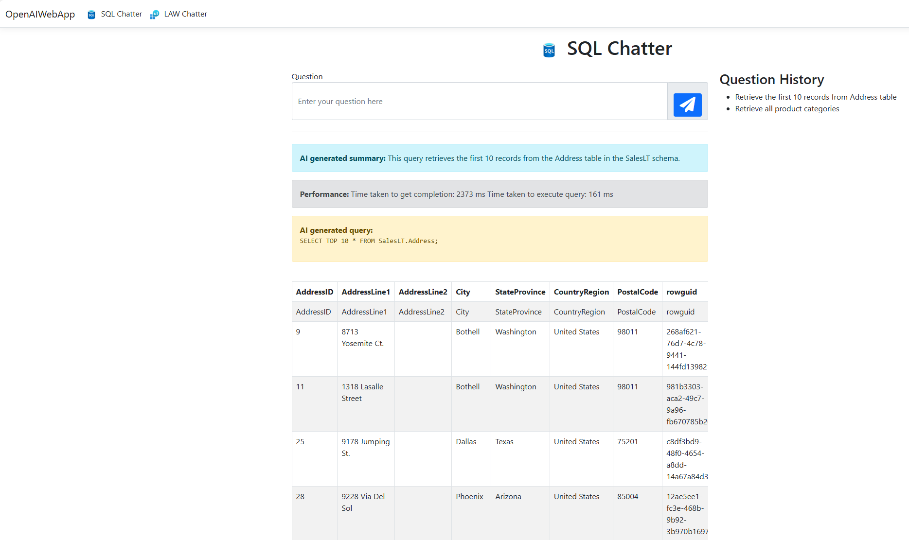

## 4. Running the Application:

* If you use Visual Studio 2022: 

  * You should install the required Nuget packages into your solution from the ide.

  * Then run the application or press F5 button.

* If you use Visual Studio Code: 

  * You should install the required Nuget packages into your solution:

     ```dotnet restore```

  * You should build and run the project with these 2 commands:
     
     ```dotnet build```

     ```dotnet run```


* The browser will open with the available port. Typically, the URL will be: ```https://localhost:7046/```

* You can try the application with your natural language inputs. (e.g., "Retrieve the first 10 records from Address table" or "Retrieve all product categories"):



* Continue testing the app to ensure it can successfully query the database using natural language inputs and display the results correctly.

&nbsp;
> Please continue to: [Conclusion](https://241.github.io/ghcopilotdemo/SQLChatter_OpenAI/0105_Conclusion.html).