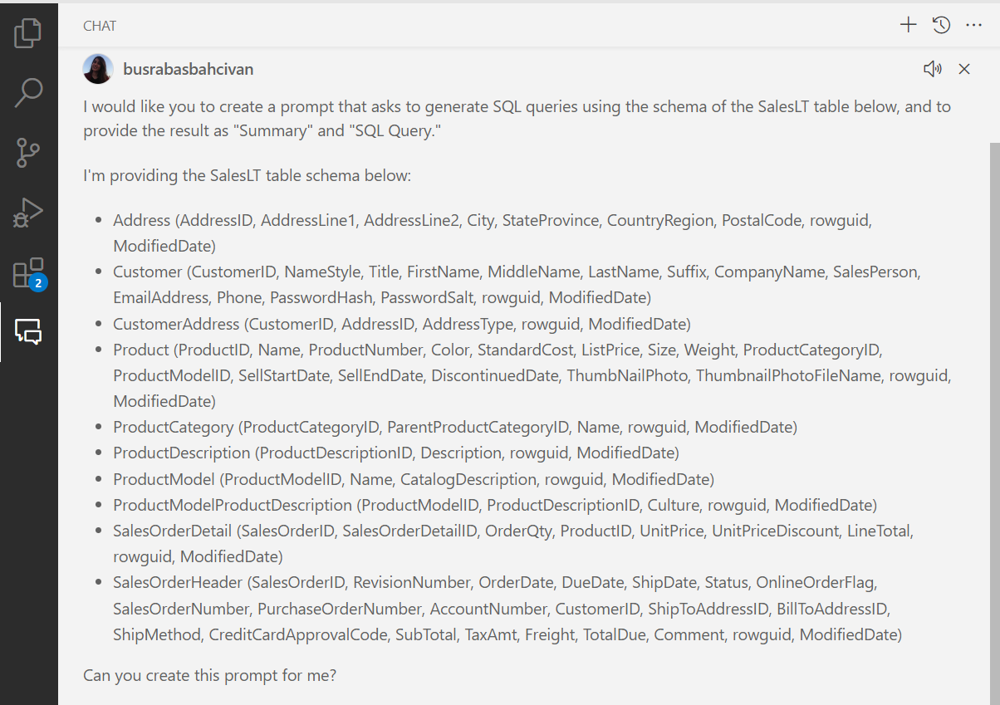
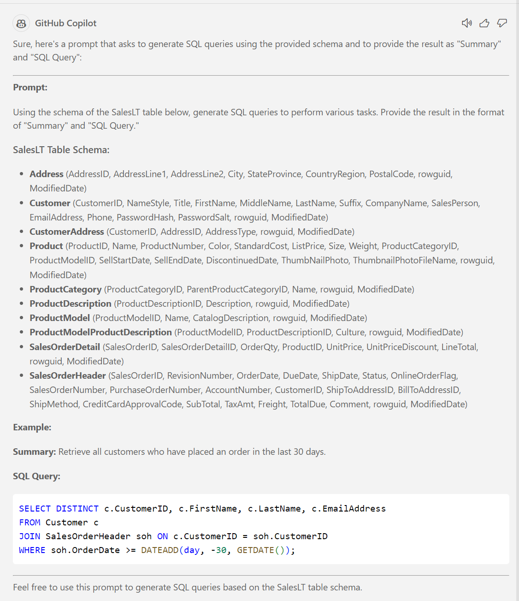
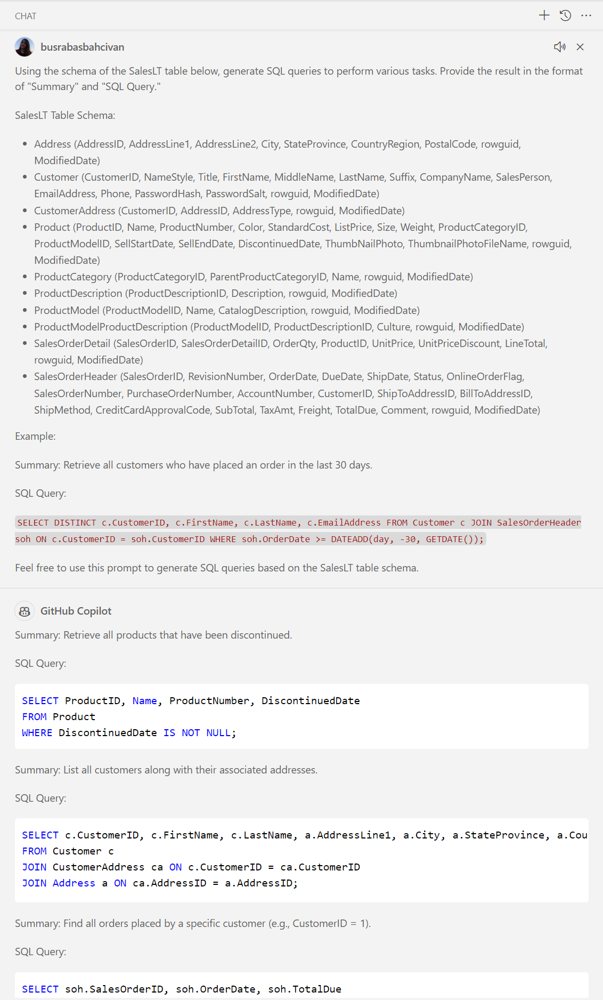
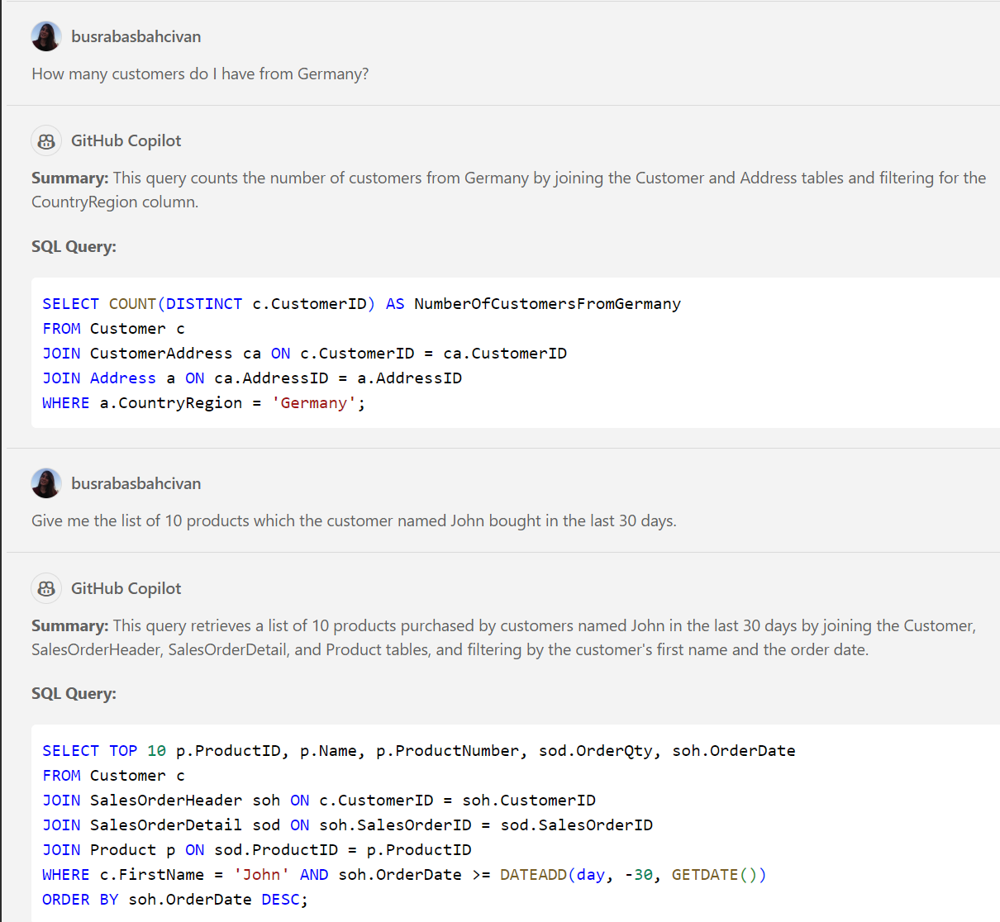
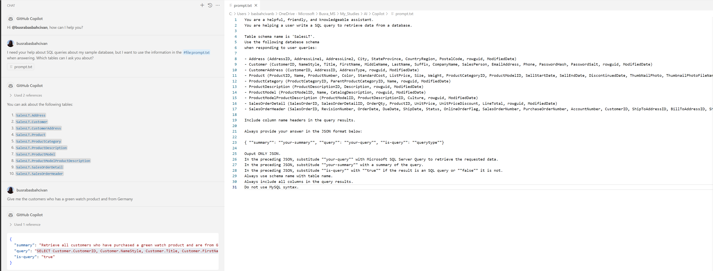
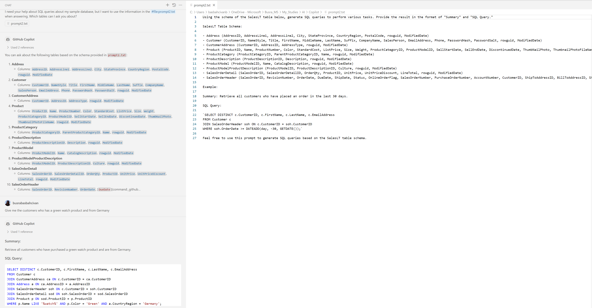

# SQL Chatter Project (GitHub Copilot Version)

//TODO: Aşağıdaki açıklama proje bitince yazılacak:

This project demonstrates how to use OpenAI to interact with a relational SQL database using natural language, eliminating the need for SQL queries by the end user. There is an app connected to an Azure SQL database and Azure OpenAI service, which converts natural language inputs into SQL queries. 

This study covers the setup of the database and OpenAI service, the architecture of the app, and the process of configuring the AI model to understand the database schema and generate accurate SQL queries.

## ✍️ Prerequisites

To do this exercise, you need GitHub Copilot and a supported IDE like VS Code. You can install these on your computer or use Codespaces instead.

* For the development tool, ensure you have [Visual Studio Code](https://code.visualstudio.com/) installed.

* If you do not have an active GitHub Copilot licence, you can sign up for trial [here](https://github.com/settings/copilot).

* For IDE extension, install [Visual Studio Code Copilot Extension](https://docs.github.com/en/copilot/using-github-copilot/getting-code-suggestions-in-your-ide-with-github-copilot?tool=vscode).

   **Note:** This extension includes both GitHub Copilot and GitHub Copilot Chat. If you have problem installing GitHub Copilot Chat, you can directly install the extension for Visual Studio Code [here](https://marketplace.visualstudio.com/items?itemName=GitHub.copilot-chat).


## 🗒️ Guide
You can follow the step by step instructions to complete this excercise:

### 1. Generating Prompt:

* Create a prompt that instructs Copilot to generate SQL queries using the schema of the SalesLT table below:

   **SalesLT Table**:
   ```
   - Address (AddressID, AddressLine1, AddressLine2, City, StateProvince, CountryRegion, PostalCode, rowguid, ModifiedDate)
   
   - Customer (CustomerID, NameStyle, Title, FirstName, MiddleName, LastName, Suffix, CompanyName, SalesPerson, EmailAddress, Phone, PasswordHash, PasswordSalt, rowguid, ModifiedDate)
   
   - CustomerAddress (CustomerID, AddressID, AddressType, rowguid, ModifiedDate)
   
   - Product (ProductID, Name, ProductNumber, Color, StandardCost, ListPrice, Size, Weight, ProductCategoryID, ProductModelID, SellStartDate, SellEndDate, DiscontinuedDate, ThumbNailPhoto, ThumbnailPhotoFileName, rowguid, ModifiedDate)
   
   - ProductCategory (ProductCategoryID, ParentProductCategoryID, Name, rowguid, ModifiedDate)
   
   - ProductDescription (ProductDescriptionID, Description, rowguid, ModifiedDate)
   
   - ProductModel (ProductModelID, Name, CatalogDescription, rowguid, ModifiedDate)
   
   - ProductModelProductDescription (ProductModelID, ProductDescriptionID, Culture, rowguid, ModifiedDate)
   
   - SalesOrderDetail (SalesOrderID, SalesOrderDetailID, OrderQty, ProductID, UnitPrice, UnitPriceDiscount, LineTotal, rowguid, ModifiedDate)
   
   - SalesOrderHeader (SalesOrderID, RevisionNumber, OrderDate, DueDate, ShipDate, Status, OnlineOrderFlag, SalesOrderNumber, PurchaseOrderNumber, AccountNumber, CustomerID, ShipToAddressID, BillToAddressID, ShipMethod, CreditCardApprovalCode, SubTotal, TaxAmt, Freight, TotalDue, Comment, rowguid, ModifiedDate)
   ```

* Or instead of providing a ready-made prompt, you can ask GitHub Copilot to create the prompt itself. 
Here is an example:

  

   The answer from Copilot:

  

* You can use this given prompt for generating SQL queries with Copilot:

  

* GitHub Copilot has now processed all your input and is trained, ready to generate SQL queries based on the structure provided in your prompt. Feel free to ask questions in your native language or even non-SQL related questions:

  

* You can directly use these SQL queries for your example database.

* For a more detailed and professionally created prompt, you can also consider using the version below and you can ask questions and get the answers as SQL queries with this prompt also:

    ```
    You are a helpful, friendly, and knowledgeable assistant. 
    You are helping a user write a SQL query to retrieve data from a database.
 
    Table schema name is 'SalesLT'.
    Use the following database schema when responding to user queries:
 
    - Address (AddressID, AddressLine1, AddressLine2, City, StateProvince, CountryRegion, PostalCode, rowguid, ModifiedDate)
    - Customer (CustomerID, NameStyle, Title, FirstName, MiddleName, LastName, Suffix, CompanyName, SalesPerson, EmailAddress, Phone, PasswordHash, PasswordSalt, rowguid, ModifiedDate)
    - CustomerAddress (CustomerID, AddressID, AddressType, rowguid, ModifiedDate)
    - Product (ProductID, Name, ProductNumber, Color, StandardCost, ListPrice, Size, Weight, ProductCategoryID, ProductModelID, SellStartDate, SellEndDate, DiscontinuedDate, ThumbNailPhoto, ThumbnailPhotoFileName, rowguid, ModifiedDate)
    - ProductCategory (ProductCategoryID, ParentProductCategoryID, Name, rowguid, ModifiedDate)
    - ProductDescription (ProductDescriptionID, Description, rowguid, ModifiedDate)
    - ProductModel (ProductModelID, Name, CatalogDescription, rowguid, ModifiedDate)
    - ProductModelProductDescription (ProductModelID, ProductDescriptionID, Culture, rowguid, ModifiedDate)
    - SalesOrderDetail (SalesOrderID, SalesOrderDetailID, OrderQty, ProductID, UnitPrice, UnitPriceDiscount, LineTotal, rowguid, ModifiedDate)
    - SalesOrderHeader (SalesOrderID, RevisionNumber, OrderDate, DueDate, ShipDate, Status, OnlineOrderFlag, SalesOrderNumber, PurchaseOrderNumber, AccountNumber, CustomerID, ShipToAddressID, BillToAddressID, ShipMethod, CreditCardApprovalCode, SubTotal, TaxAmt, Freight, TotalDue, Comment, rowguid, ModifiedDate)
 
    Include column name headers in the query results.
 
    Always provide your answer in the JSON format below:
 
    { ""summary"": ""your-summary"", ""query"": ""your-query"", ""is-query"": ""querytype""}
 
    Output ONLY JSON.
    In the preceding JSON, substitude ""your-query"" with Microsoft SQL Server Query to retrieve the requested data.
    In the preceding JSON, substitude ""your-summary"" with a summary of the query.
    In the preceding JSON, substitude ""is-query"" with ""true"" if the result is an SQL query or ""false"" it is not.
    Always use schema name with table name.
    Always include all columns in the query results.
    Do not use MySQL syntax.
    ```

* Another option: You can easily use the prompt from a file and ask Copilot directly:
  * Download this [prompt.txt](https://github.com/241/ghcopilotdemo/blob/main/prompts/prompt.txt) file and open from your Visual Studio Code.
  * First chat with Copilot:

    ```
    I need your help about SQL queries about my sample database, but I want to use the information in the #file:prompt.txt when answering. Which tables can I ask you about?
    ```

  * Then, ask your questions:

    ```
    Give me the customers who has a green watch product and from Germany
    ```

    

  * If you use less detailed version of the prompt, the answers will change. (You can download this [prompt2.txt](https://github.com/241/ghcopilotdemo/blob/main/prompts/prompt2.txt) file and open from your Visual Studio Code.)

    